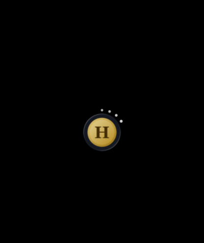
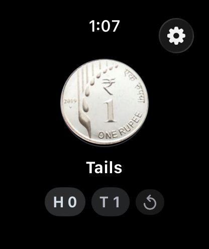

# Coin Toss

A watchOS app for settling things. Tap anywhere, watch the coin tumble, and read
the answer off your wrist.

 

## What it does

- **Tap anywhere to toss.** The whole screen is the target — no precision
  tapping while you're moving.
- **A coin that behaves like a coin.** It launches off the thumb, decelerates to
  an apex, falls back faster and faster, then bounces once and settles. The face
  is revealed on touchdown, not at the end of the animation.
- **Eight coins.** Three are photographs of real currency — a US cent, an Indian
  one rupee and an 1887 British gold £5 — and five are drawn at runtime.
- **A coin that suits where you are.** First launch picks the coin for your
  region: US → US Cent, India → Rupee, UK → Five Pounds. Anywhere else gets the
  plain heads/tails coin rather than someone else's currency.
- **Real coin sounds**, trimmed from public-domain field recordings, plus haptics
  on launch and landing. Mutable in Settings.
- **A running tally** of heads and tails, with a reset beside it.
- **VoiceOver throughout**, including a single spoken tally summary that carries
  the current streak.

## Requirements

- Xcode 26 or newer
- watchOS 11.0 deployment target (built against the watchOS 26.5 SDK)
- A watchOS simulator runtime: `xcodebuild -downloadPlatform watchOS`

## Build and run

```sh
xcodebuild build \
  -project CoinToss.xcodeproj \
  -scheme CoinToss \
  -destination 'platform=watchOS Simulator,name=Apple Watch Series 11 (46mm)'
```

Or just open `CoinToss.xcodeproj` and hit run.

## Tests

```sh
xcodebuild test \
  -project CoinToss.xcodeproj \
  -scheme CoinToss \
  -destination 'platform=watchOS Simulator,name=Apple Watch Series 11 (46mm)'
```

40 unit tests and 6 UI tests. The unit tests are pure logic — `CoinFlipper`
takes its randomness as an injected closure, so every tally, streak and history
assertion is deterministic. They also assert that every sound and every coin
photograph the code references is actually present in the built bundle, which is
the failure that would otherwise only show up as a silent app.

The UI tests drive the real app on the simulator: tapping the coin, watching the
tally accumulate, resetting it, and walking the full coin list in Settings.

## Layout

```
CoinToss Watch App/     the app
  CoinFlipper.swift       tosses, tallies, streaks — no UI, no globals
  CoinStyle.swift         the eight coins, and the region → coin mapping
  CoinArt                 a face is a letter, an SF Symbol, or a photograph
  FlipMotion.swift        the flight, as keyframe tracks
  CoinView.swift          draws a coin, or shows one
  ContentView.swift       the toss screen
  SettingsView.swift      coin picker and sound toggle
  SoundPlayer.swift       cached, pre-rolled AVAudioPlayers
CoinTossTests/          unit tests
CoinTossUITests/        UI tests, driven on the simulator
Tools/                  regenerates every bundled asset from its source
```

## Assets

Nothing in this repo is an unexplained binary. Each bundled asset is rebuilt
from a public-domain or CC0 source by a script in `Tools/`:

```sh
swift Tools/GenerateAppIcon.swift "CoinToss Watch App/Assets.xcassets/AppIcon.appiconset/AppIcon.png"
swift Tools/PrepareCoinImages.swift "CoinToss Watch App/Assets.xcassets/Coins"
python3 Tools/PrepareSounds.py "CoinToss Watch App/Sounds"
```

The image and sound scripts download their sources from Wikimedia Commons, so
they need a network connection. See [CREDITS.md](CREDITS.md) for every source
and its licence.

## Adding a coin

Append a `CoinStyle` to `CoinStyle.all`. Drawn coins need only colours and two
`CoinArt` values. Photographic coins additionally need a matched obverse/reverse
pair added to the manifest in `Tools/PrepareCoinImages.swift`; keep to
public-domain or CC0 sources so the app stays free of attribution obligations.
To tie a coin to a region, add it to `CoinStyle.byRegion`.

The tests will tell you if you get it wrong: they check that identifiers and
names are unique, that no coin shows the same art on both faces, that a
photographic coin uses photographs on *both* faces, and that every referenced
image is actually in the bundle.
